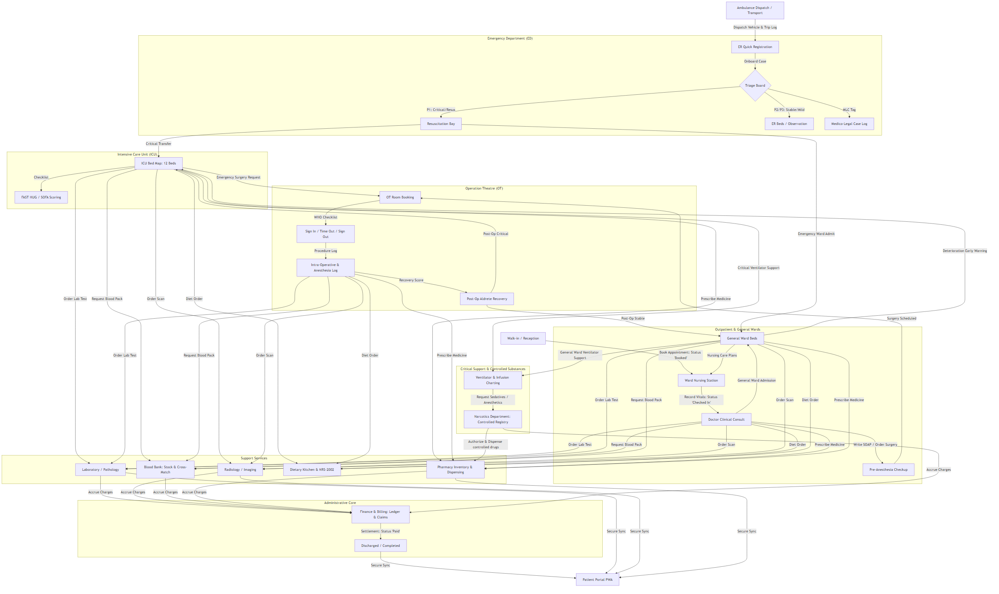
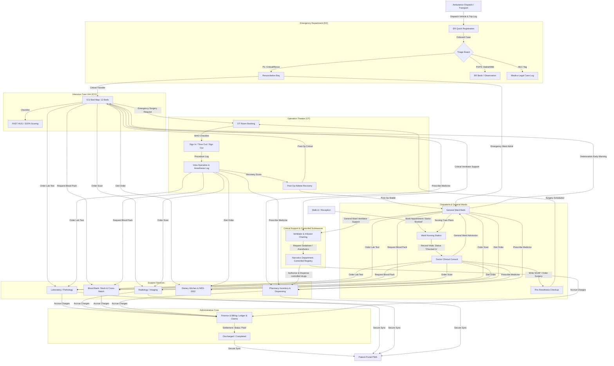

# Hospital EHR Data Flow & Architectural Simplification Plan

This plan maps out the logical flow of patient and clinical data across the various departments of Auratral HealthOS, and proposes architectural simplifications to make the user interface more intuitive, automated, and aligned with standard clinical operations.

## Comprehensive Clinical Workflow Flowchart

Below is a detailed Mermaid diagram visualizing how patients and data flow across all departments, including **Emergency**, **ICU**, **OT / Surgery**, **Blood Bank**, **Diet & Nutrition**, and **Ambulance Dispatch**:

---

## Departmental Data Flow Interactions

Here is how data flows between the advanced departments and the core EHR:

### 1. Emergency Department (ED)
*   **Ambulance & Transport Interface**: When an ambulance is dispatched, paramedic trip logs and patient vitals collected en route are fed directly to the ER Quick Registration desk, alerting the trauma team.
*   **Triage Integration**: Triage categories (Red/Orange/Yellow/Green/Blue) automatically determine queue placement. A Medico-Legal Case (MLC) tag triggers a secure sub-flow prompting the collection of police info and FIR logs.

### 2. Operation Theatre (OT)
*   **Pre-Anesthesia Checkup (PAC)**: Completed by anesthetists, this log documents airway classification, ASA scoring, and history, which must be signed off before the OT schedule panel allows the procedure to proceed.
*   **WHO Checklist**: A digital checklist enforcing Sign In (before anesthesia), Time Out (before skin incision), and Sign Out (before patient leaves OT) is mandatory to log surgical completion.
*   **Post-Op Transfers**: Aldrete recovery scores determine disposition: patients with scores $\ge 9$ are routed to general wards, while lower scores trigger ICU bed requests.

### 3. Intensive Care Unit (ICU)
*   **Critical Care Admissions**: ICU beds are mapped on a 12-bed visualization chart, directly linked to ventilator status, infusion rate charting, and early warning scores (EWS).
*   **Clinical Scoring System**: Tracks APACHE/SOFA scores and enforces the daily "FAST HUG" checklist (Feeding, Analgesia, Sedation, Thromboembolic prophylaxis, Head-of-bed elevation, Ulcer prophylaxis, Glycemic control).

### 4. Blood Bank
*   **Requests & Cross-Matching**: OT/ICU physicians send cross-match requests. The blood bank system verifies donor compatibility against the live blood grouping registry, issues components (PRBC/FFP/Platelets), and logs transfusion reactions.

### 5. Diet & Nutrition
*   **Nutritional Risk Screening (NRS-2002)**: Nurses perform nutritional screening, and dietitians enter specific diets (e.g., Low Sodium, Diabetic Carbohydrate Restricted) that populate the dietary kitchen count summary.

---

## Proposed Simplifications & Flow Optimizations

1.  **Direct Department Billing Accrual**: Every lab result, radiology scan, blood request, surgical procedure, and pharmacy drug dispensed will automatically append its cost directly to the patient's billing ledger in the Finance panel, eliminating manual billing entries.
2.  **Unified Department Routing**: Clicking on any department overview widget (e.g., a card showing active complaints, devices under maintenance, or ICU beds) will automatically route the user to that department's dedicated management sub-panel.
3.  **Bypass Login Persistence**: When developer bypass logins are active, a session flag (`STATE.isLocalBypassActive`) will protect the current role panel views from being overridden by standard auth listeners.

---

## Verification Plan

### Automated Tests
- Run `npm run build` to verify there are no compilation or layout errors with the updated data flow.

### Manual Verification
- Log in as **Ambulance Driver** (`transport@atralos.com`) -> Create a Trip Log.
- Log in as **ER Doctor** (`emergency@atralos.com`) -> View the case on the Triage Board, tag as MLC, and transfer to ICU Bed.
- Log in as **ICU Specialist** (`icu@atralos.com`) -> Verify ICU Bed 1 is occupied and view the ventilator charting.
- Log in as **Blood Bank Officer** (`bloodbank@atralos.com`) -> Request A+ blood for the patient and verify compatibility logs.
